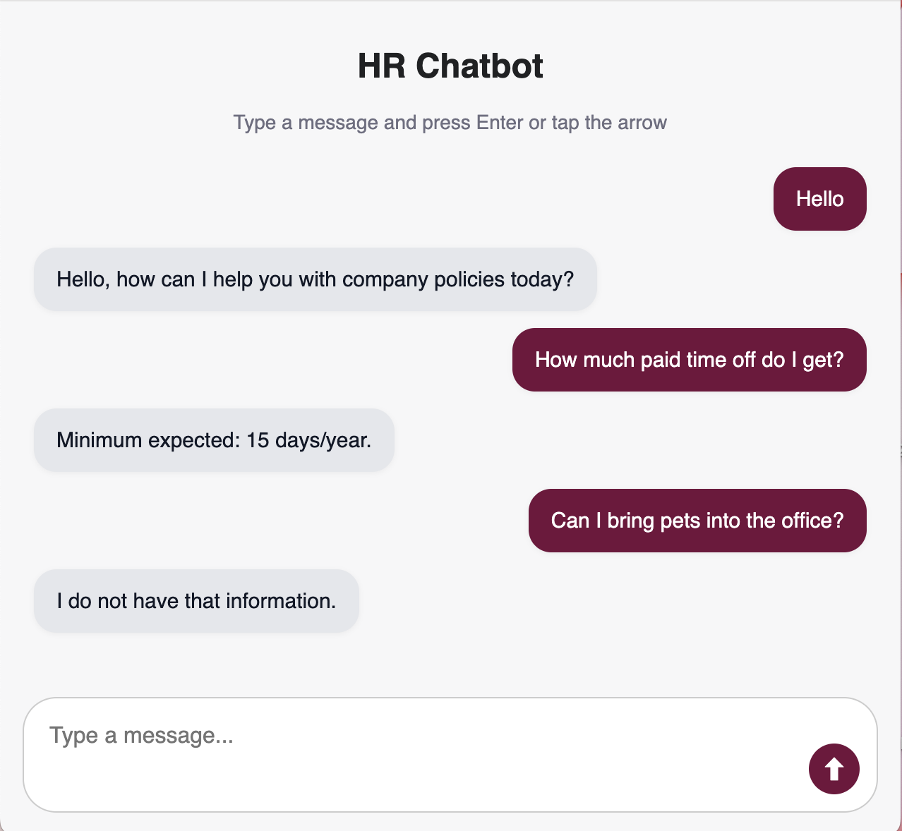

# RAG Chatbot for HR
A Retrieval-Augmented Generation (RAG) chatbot designed to assist with HR-related queries by combining large language models with a custom document retrival system.



# Overview
This chatbot leverages a RAG pipeline to provide accurate and context-aware answers to HR-related questions. It retrieves relevant documents from a vector store and uses a large language model to generate responses based on that information. It is adaptable to many knowledge bases, with minimal changes to model prompting and documents provided for RAG querying.

# Architecture
User -> Frontend (React/Vite) -> Backend (Python API) -> Vector Store + LLM -> Response


**Frontend:** Built with HTML/CSS/JS using Vite


**Backend:** Python API for handling queries and document retrieval


**Vector Store:**: Stores embedded HR documents in OpenSearch for semantic search


**LLM:** Generated responses based on retrieved content

# Prerequisites

* Python 3.10+
* Node.js 18+
* Docker

# Installation
**Step 1: Clone Repo**

```
git clone https://github.com/HR-RAG-Chatbot.git
```

**Step 2: Install Dependencies**

```
pip install json
pip install requests
pip install boto3
pip install PyPDF2
pip install flask

npm install
```

**Step 3: Run OpenSearch**

```
docker-compose up
```

**Step 4: Run App**
* Add API Key for run_rag.py
* Frontend
  ```
  npm run dev
  ```
* Backend
  ```
  python /backendServer/run_rag.py

**Step 5: Application use**

**Add docyments:**
* run command ```python embedd_docs.py```

**Query Chatbot:**
* Navigate to http://localhost:3000 in your browser.
* Ask HR related questions like "What is the vacation policy?" or "What are my benifits?"

